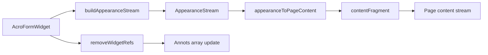

# PDF Forms Engine (Phase 6)

AcroForm parsing, widget appearance synthesis, and field flattening for interactive PDF forms.

## Problem

Interactive PDF forms store field values separately from page content. Flattening bakes field visuals into the static page so recipients cannot edit them — required for archival, print, and many compliance workflows.

## Architecture

```
PDF catalog (/AcroForm)
  → forms/types.ts       (field + widget model)
  → forms/flatten-field.ts
       buildAppearanceStream()  — AP/N content for Tx, Btn, Ch
       flattenField()            — widget → page content fragment
  → writer/ (future)     — append content, strip Annots
```

## ISO 32000-2 References

| Topic | Section |
|-------|---------|
| Interactive forms | §12.7 |
| Field dictionaries | §12.7.4 |
| Field flags (Ff) | §12.7.4.2 |
| Widget annotations | §12.5.6 |
| Appearance streams | §12.5.5 |
| Default appearance (/DA) | §12.7.3.3 |

## Field Types (FT)

| FT | Name | Appearance strategy |
|----|------|---------------------|
| Tx | Text | `/Helvetica` Tj at padded rect origin |
| Btn | Button | Checkbox cross when value matches export |
| Ch | Choice | First selected option as text |
| Sig | Signature | Deferred — requires Phase 10 CMS overlay |

## Appearance Stream Builder

Normal appearance (`AP` → `N`) is built as a minimal content stream:

1. `q` — save graphics state
2. Optional border: `w`, `re S`
3. Optional background fill
4. Field-type body (text `BT … Tj ET`, or checkbox marks)
5. `Q` — restore

**BBox** equals widget `/Rect` in default user space.

**Matrix:** Flatten inserts content at page coordinates; no additional CTM when rect already matches annotation space.

### Text field math

```
tx = rect.x + pad
ty = rect.y + rect.height × 0.25   // baseline heuristic
```

Pad = max(2, borderWidth + 1).

### Checkbox math

Inscribed mark uses diagonal lines across inner rect:

```
inset = min(w, h) × 0.2
inner = [x+inset, y+inset] → [x+w-inset, y+h-inset]
```

## flattenField() Algorithm

```
Input: AcroFormWidget, FlattenFieldOptions
1. appearance ← buildAppearanceStream(widget, options)
2. fragment   ← appearanceToPageContent(appearance, widget)
3. Return { contentFragment, removeWidgetRefs: [widget.ref] }
```

Page integration (writer layer):

1. Append `contentFragment` to page content stream
2. Remove widget ref from `/Annots`
3. Optionally delete AcroForm field entry when all widgets flattened

**Complexity:** O(1) per widget; O(n) for n widgets on a page.

**Memory:** O(text length) for synthesized streams.

## Gap Analysis vs Adobe Acrobat

| Capability | Acrobat | This engine |
|------------|---------|-------------|
| Tx / Btn / Ch appearance | Full DA parsing, font embedding | Basic Helvetica/ZaDb synthesis |
| Multi-line Tx (Ff multiline) | Yes | Not yet — single-line Tj |
| Rich text (RV) | Yes | Not supported |
| JavaScript calculate | Full Acrobat JS | Not supported |
| XFA forms | Legacy support | Not supported (deprecated in PDF 2.0) |
| Radio button groups | Mutual exclusion | Partial — export value match only |
| Flatten in-place | Yes | Returns fragments; writer wires persistence |
| NeedAppearances | Auto-regenerates | Always synthesizes when flattening |

## Edge Cases

- Zero-size `/Rect` → skip or 100×20 fallback in `parseWidgetRect`
- Missing `/V` → empty text, unchecked box
- `/AP` existing stream → future: prefer stream over synthesis
- Rotated pages (`/Rotate`) → appearance must apply page rotation matrix (future)
- Signature fields → require Phase 10 visual stamp

## Testing Strategy

- Unit: `buildAppearanceStream` output contains `BT`, `Tj`, `re S` as expected per type
- Golden: flatten sample Tx/Btn, parse content stream operators
- Integration: flatten page widgets → no remaining `/Widget` in Annots

## Data Flow


